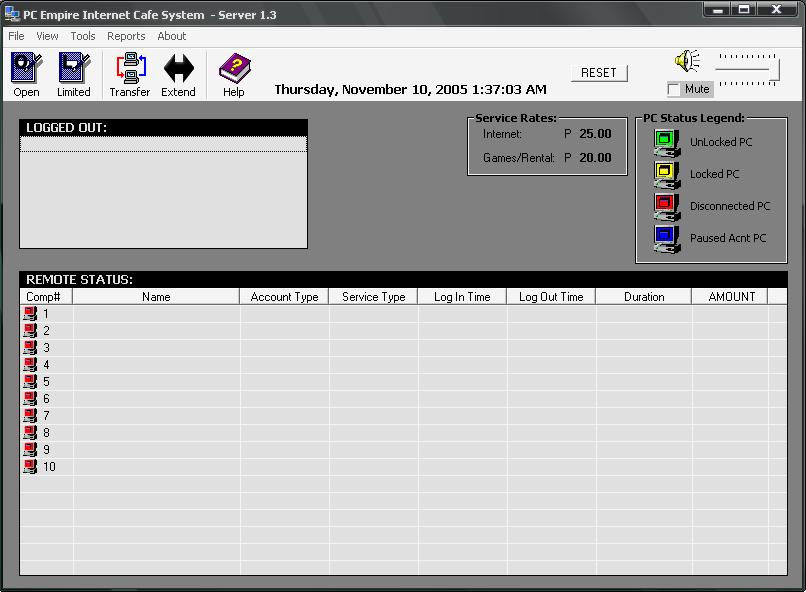



## Iron's Internet Cafe System

### Description

Client/Server Appz, Billing system, client unlocks monitoring, client screen-lock, web server(IIS). etc. Database password = 'GallanosA' The client screen-lock works only in win98. This is the unfinished version. This is good for newbie to study the socket programming and making a usercontrol. If you find this useful, please vote for me!

Thank You!!! Mabuhay!
 
### More Info
 

             |
---                |---
**Submitted On**   |2005-11-10 01:35:38
**By**             |[Aeron Gregory Murilla](https://github.com/Planet-Source-Code/PSCIndex/blob/master/ByAuthor/aeron-gregory-murilla.md)
**Level**          |Intermediate
**User Rating**    |5.0 (65 globes from 13 users)
**Compatibility**  |VB 6\.0
**Category**       |[Complete Applications](https://github.com/Planet-Source-Code/PSCIndex/blob/master/ByCategory/complete-applications__1-27.md)
**World**          |[Visual Basic](https://github.com/Planet-Source-Code/PSCIndex/blob/master/ByWorld/visual-basic.md)
**Archive File**   |[Iron''s\_In1947191192005\.zip](https://github.com/Planet-Source-Code/aeron-gregory-murilla-iron-s-internet-cafe-system__1-63210/archive/master.zip)

